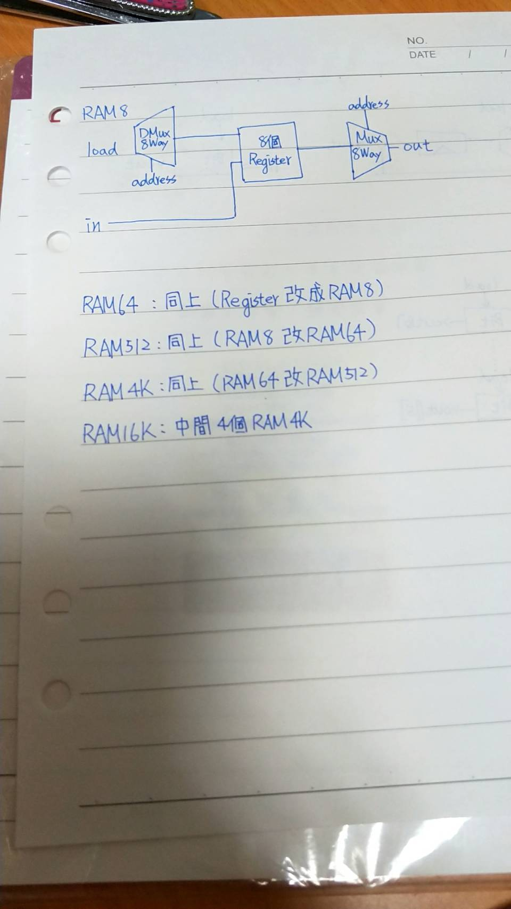

# WEEK7
## RAM8
    // This file is part of www.nand2tetris.org
    // and the book "The Elements of Computing Systems"
    // by Nisan and Schocken, MIT Press.
    // File name: projects/03/a/RAM8.hdl

    /**
     * Memory of 8 registers, each 16 bit-wide. Out holds the value
     * stored at the memory location specified by address. If load==1, then 
     * the in value is loaded into the memory location specified by address 
     * (the loaded value will be emitted to out from the next time step onward).
     */

    CHIP RAM8 {
        IN in[16], load, address[3];
        OUT out[16];

        PARTS:
        // Put your code here:
        DMux8Way(in=load, sel=address, a=a, b=b, c=c, d=d, e=e, f=f, g=g, h=h);
        Register(in=in, load=a, out=r0);
        Register(in=in, load=b, out=r1);
        Register(in=in, load=c, out=r2);
        Register(in=in, load=d, out=r3);
        Register(in=in, load=e, out=r4);
        Register(in=in, load=f, out=r5);
        Register(in=in, load=g, out=r6);
        Register(in=in, load=h, out=r7);
        Mux8Way16(a=r0, b=r1, c=r2, d=r3, e=r4, f=r5, g=r6, h=r7, sel=address, out=out);
    }

## RAM64
    // This file is part of www.nand2tetris.org
    // and the book "The Elements of Computing Systems"
    // by Nisan and Schocken, MIT Press.
    // File name: projects/03/a/RAM64.hdl

    /**
     * Memory of 64 registers, each 16 bit-wide. Out holds the value
     * stored at the memory location specified by address. If load==1, then 
     * the in value is loaded into the memory location specified by address 
     * (the loaded value will be emitted to out from the next time step onward).
     */

    CHIP RAM64 {
        IN in[16], load, address[6];
        OUT out[16];

        PARTS:
        // Put your code here:
        DMux8Way(in=load, sel=address[3..5], a=a, b=b, c=c, d=d, e=e, f=f, g=g, h=h);
        RAM8(in=in, load=a, address=address[0..2], out=r0);
        RAM8(in=in, load=b, address=address[0..2], out=r1);
        RAM8(in=in, load=c, address=address[0..2], out=r2);
        RAM8(in=in, load=d, address=address[0..2], out=r3);
        RAM8(in=in, load=e, address=address[0..2], out=r4);
        RAM8(in=in, load=f, address=address[0..2], out=r5);
        RAM8(in=in, load=g, address=address[0..2], out=r6);
        RAM8(in=in, load=h, address=address[0..2], out=r7);
        Mux8Way16(a=r0, b=r1, c=r2, d=r3, e=r4, f=r5, g=r6, h=r7, sel=address[3..5], out=out);
    }

## RAM512
    // This file is part of the materials accompanying the book 
    // "The Elements of Computing Systems" by Nisan and Schocken, 
    // MIT Press. Book site: www.idc.ac.il/tecs
    // File name: projects/03/b/RAM512.hdl

    /**
     * Memory of 512 registers, each 16 bit-wide. Out holds the value
     * stored at the memory location specified by address. If load==1, then 
     * the in value is loaded into the memory location specified by address 
     * (the loaded value will be emitted to out from the next time step onward).
     */

    CHIP RAM512 {
        IN in[16], load, address[9];
        OUT out[16];

        PARTS:
        // Put your code here:
        DMux8Way(in=load, sel=address[6..8], a=a, b=b, c=c, d=d, e=e, f=f, g=g, h=h);
        RAM64(in=in, load=a, address=address[0..5], out=r0);
        RAM64(in=in, load=b, address=address[0..5], out=r1);
        RAM64(in=in, load=c, address=address[0..5], out=r2);
        RAM64(in=in, load=d, address=address[0..5], out=r3);
        RAM64(in=in, load=e, address=address[0..5], out=r4);
        RAM64(in=in, load=f, address=address[0..5], out=r5);
        RAM64(in=in, load=g, address=address[0..5], out=r6);
        RAM64(in=in, load=h, address=address[0..5], out=r7);
        Mux8Way16(a=r0, b=r1, c=r2, d=r3, e=r4, f=r5, g=r6, h=r7, sel=address[6..8], out=out);
    }

## RAM4K
    // This file is part of www.nand2tetris.org
    // and the book "The Elements of Computing Systems"
    // by Nisan and Schocken, MIT Press.
    // File name: projects/03/b/RAM4K.hdl

    /**
     * Memory of 4K registers, each 16 bit-wide. Out holds the value
     * stored at the memory location specified by address. If load==1, then 
     * the in value is loaded into the memory location specified by address 
     * (the loaded value will be emitted to out from the next time step onward).
     */

    CHIP RAM4K {
        IN in[16], load, address[12];
        OUT out[16];

        PARTS:
        // Put your code here:
        DMux8Way(in=load, sel=address[9..11], a=a, b=b, c=c, d=d, e=e, f=f, g=g, h=h);
        RAM512(in=in, load=a, address=address[0..8], out=r0);
        RAM512(in=in, load=b, address=address[0..8], out=r1);
        RAM512(in=in, load=c, address=address[0..8], out=r2);
        RAM512(in=in, load=d, address=address[0..8], out=r3);
        RAM512(in=in, load=e, address=address[0..8], out=r4);
        RAM512(in=in, load=f, address=address[0..8], out=r5);
        RAM512(in=in, load=g, address=address[0..8], out=r6);
        RAM512(in=in, load=h, address=address[0..8], out=r7);
        Mux8Way16(a=r0, b=r1, c=r2, d=r3, e=r4, f=r5, g=r6, h=r7, sel=address[9..11], out=out);
    }

## RAM16K
    // This file is part of www.nand2tetris.org
    // and the book "The Elements of Computing Systems"
    // by Nisan and Schocken, MIT Press.
    // File name: projects/03/b/RAM16K.hdl

    /**
     * Memory of 16K registers, each 16 bit-wide. Out holds the value
     * stored at the memory location specified by address. If load==1, then 
     * the in value is loaded into the memory location specified by address 
     * (the loaded value will be emitted to out from the next time step onward).
     */

    CHIP RAM16K {
        IN in[16], load, address[14];
        OUT out[16];

        PARTS:
        // Put your code here:
        DMux4Way(in=load, sel=address[12..13], a=a, b=b, c=c, d=d);
        RAM4K(in=in, load=a, address=address[0..11], out=r0);
        RAM4K(in=in, load=b, address=address[0..11], out=r1);
        RAM4K(in=in, load=c, address=address[0..11], out=r2);
        RAM4K(in=in, load=d, address=address[0..11], out=r3);
        Mux4Way16(a=r0, b=r1, c=r2, d=r3, sel=address[12..13], out=out);
    }

